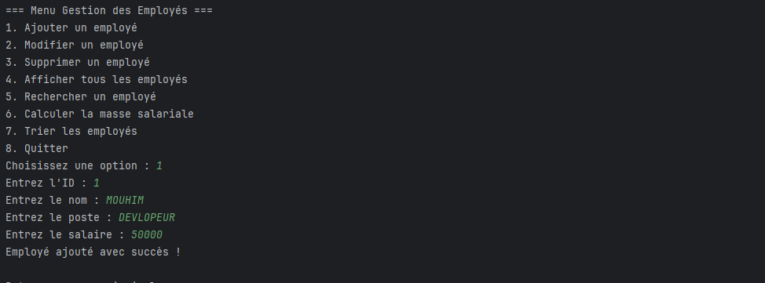

<h2>Application de Gestion des Employés Ecrans montrant l’exécution de chaque besoin</h2>
<h4>1. printMenu() : Afficher le menu principal avec les options disponibles.</h4>

<h4>2. ajouterEmploye(Employe employe) : Ajouter un nouvel objet Employe au tableau.</h4>

<h4>3. modifierEmploye(int id, String nouveauNom, String nouveauPoste, double nouveauSalaire) : Modifier un employé existant.</h4>

<h4>4. supprimerEmploye(int id) : Supprimer un employé du tableau à l’aide de son identifiant.</h4>

<h4>5. afficherEmployes() : Afficher tous les employés du tableau.</h4>

<h4>6. rechercherEmploye(String critere) : Rechercher un employé par nom ou poste, et afficher ses informations.</h4>

<h4>7. calculerMasseSalariale() : Calculer la somme des salaires des employés présents dans le tableau.</h4>

<h4>trierEmployesParSalaire(boolean ordreCroissant) : Trier et afficher les employés par salaire dans l’ordre choisi (croissant ou décroissant).</h4>
<h6>Croissant</h6>

<h6>Décroissant</h6>
